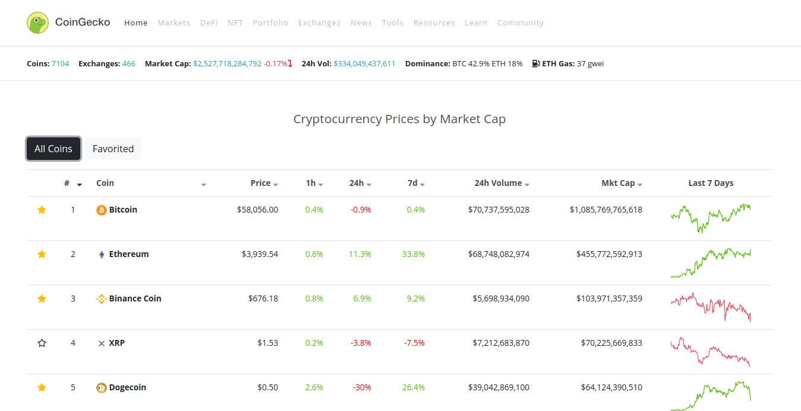
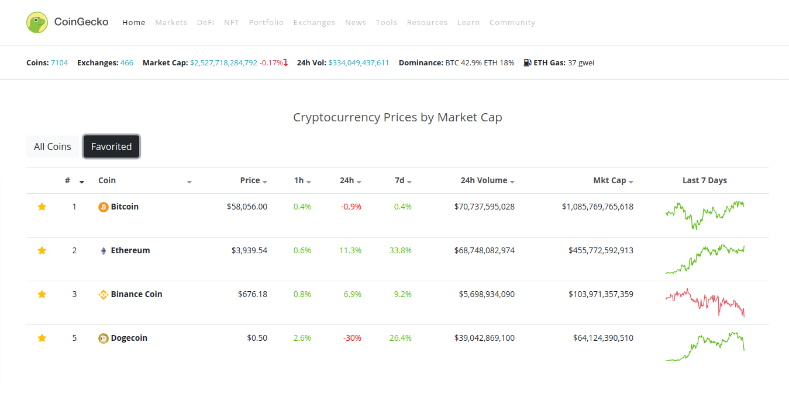
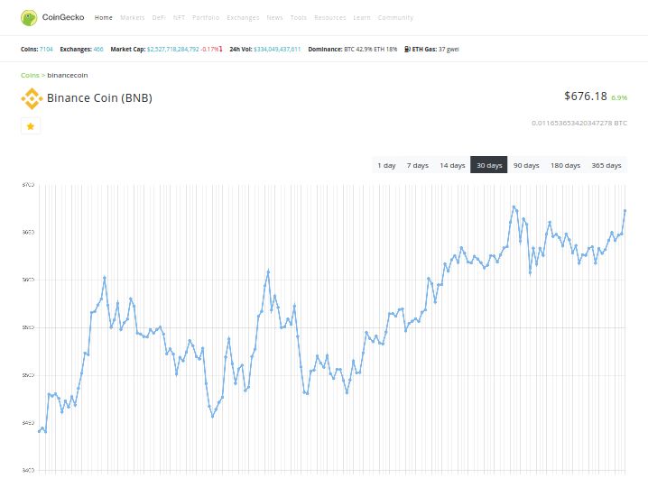

# crypto-insights Clone

Cloned version of [crypto-insights](https://www.crypto-insights.com/en) (only main page for interview purpose).

## Demo

[https://donztea-crypto-insights-clone.netlify.app](https://donztea-crypto-insights-clone.netlify.app)

## Highlighted User Interfaces

## How to run

> 1. install node.js
> 2. clone repository
> 3. execute `npm install`
> 4. execute `npm audit fix`
> 5. execute `npm start`
> 6. now server application is running on http://localhost:3000
